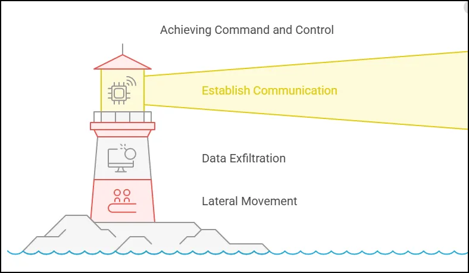

# Lockheed Martin Cyber Kill Chain

In the next few lessons we will explore cyber defense frameworks and models that help describe the different stages of a cyberattack. One of the most well-known frameworks is the Cyber Kill Chain, developed by Lockheed Martin. The term "kill chain" actually comes from military strategy, where it describes the process of identifying and neutralizing a target. In cybersecurity, the kill chain model helps us break down and understand each phase of an attack, allowing organizations to detect and respond to adversaries more effectively.

The Cyber Kill Chain consists of seven stages, with each stage representing a step in the attacker’s journey. Understanding each stage helps analysts and organizations build strong, layered defenses that can intercept an attack at multiple points. Some people find the model a bit rigid or say it doesn’t account for all attack types, but it still provides a valuable foundation for understanding and preparing for typical cyber threats.

Let’s start with **reconnaissance**, the first stage. This is where the attacker gathers information about their target. Similar to a military operation, reconnaissance often takes the most time. Attackers may collect as much public or open-source intelligence (OSINT) as they can, gathering details on the organization, its employees, and systems. This can include names, emails, job roles, or even interests, all of which can be used to tailor attacks. Attackers might also use active techniques like network scanning or social engineering to identify vulnerabilities.

Once enough information is gathered, the attacker moves to the **weaponization** phase, where they create the malware or payload designed to exploit the weaknesses identified in reconnaissance. This payload could be a phishing email attachment, a malicious link, or an exploit embedded in a seemingly harmless document. In some cases, attackers may even chain multiple exploits together to maximize their chances of success.

Next is **delivery**, where the attacker actually gets the payload to the target. This could involve sending a phishing email, planting a malicious USB, or leveraging a supply chain attack. In fact, one of the first major supply chain attacks occurred in the 2013 Target data breach, where attackers compromised a third-party vendor with network access to Target.

Once delivered, the attacker moves to the **exploitation** phase. Here, the payload is executed on the target system, and any vulnerabilities in software or system configurations are exploited. This phase is where attackers gain control over the target, often through remote code execution, to establish their presence.

With control established, the attacker needs to ensure they maintain it, which brings us to **installation**. Here, they install additional malware like backdoors or rootkits to ensure persistent access to the compromised system, even if it reboots or if patches are applied. This persistence can be achieved through mechanisms like registry entries, scheduled tasks, or DLL injections.

The next step is **command and control (C2)**. Attackers set up a communication channel between the compromised system and their own infrastructure. This allows them to send commands, exfiltrate data, or move laterally within the network. While detecting C2 channels can be challenging due to common protocols like HTTP and DNS, analysts can look for unusual patterns like regular beacons or unusually long sessions.

Finally, we reach **actions on objective**, where the attacker’s main goals come into play. Depending on their motives, this could involve data theft, credential harvesting, ransomware deployment, or system sabotage. The attacker may also try to gather more credentials to spread through the network or perform data exfiltration, as in the Target breach where attackers stole millions of credit card details.

Though some consider the Cyber Kill Chain too rigid, it gives a structured view of the attack lifecycle, helping organizations build comprehensive defenses. Security strategies like network monitoring, endpoint protection, and employee training can be aligned with each kill chain stage, creating a layered defense approach. Additionally, the Unified Kill Chain and MITRE ATT&CK framework build on this model, addressing some of its limitations and providing a more integrated view of adversarial behavior.