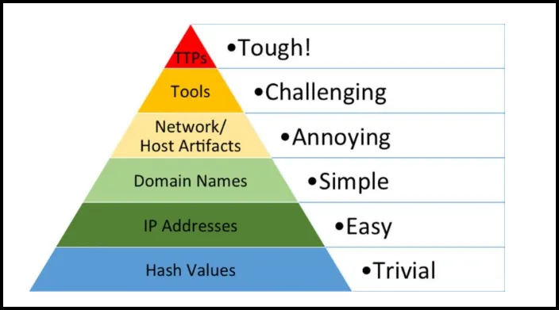

# Pyramid of Pain

**Introduction:**

**David Bianco’s Pyramid of Pain** is a model in cybersecurity that illustrates the challenges adversaries face when defenders disrupt different aspects of their operations. The pyramid is structured as a hierarchy of indicators, ranging from low to high complexity and impact, with each level representing a different type of information defenders can detect, block, or analyze. As defenders interfere with elements higher up on the pyramid, adversaries experience greater "pain," or difficulty, in adapting their techniques, tactics, and procedures (TTPs).

### Pyramid of Pain Structure and Levels

The pyramid has six levels, from the base (least impact on adversaries) to the top (most impact on adversaries):

1. **Hash Values (Lowest Level)**
    - **Description**: Hash values are unique identifiers (checksums) created from files, usually used to detect specific files or malware. They include MD5, SHA-1, and SHA-256, among others.
    - **Difficulty for the Adversary**: Low. Adversaries can easily change hash values by making minor modifications to files, generating new files, or using different packing techniques, which changes the hash and renders the detection ineffective.
    - **Defender Impact**: Blocking or detecting files based on hash values is simple for defenders and can catch known malicious files. However, it offers limited value because adversaries can alter hashes with minimal effort.
2. **IP Addresses**
    - **Description**: IP addresses represent the network location or source of traffic, which can be used to block traffic from known malicious sources.
    - **Difficulty for the Adversary**: Low to moderate. Although blocking IP addresses can hinder certain connections, adversaries can quickly change IPs using VPNs, proxies, or by switching compromised systems.
    - **Defender Impact**: IP address blocking can slow adversaries down by cutting off known locations, but it’s relatively ineffective over time. Adversaries can switch IPs rapidly, making it challenging for defenders to rely solely on IP address detection.
3. **Domain Names**
    - **Description**: Domain names are used to identify hostnames in network connections and can help track adversary-controlled infrastructure, such as command and control (C2) servers.
    - **Difficulty for the Adversary**: Moderate. Changing domain names is more effort-intensive than changing IP addresses but still manageable. Adversaries may register multiple domains in advance or use dynamic DNS services to rotate domain names.
    - **Defender Impact**: Blocking known malicious domains can disrupt adversary communications temporarily. However, dedicated attackers can cycle through domains, so defenders need to monitor changes in real time.
4. **Network/Host Artifacts**
    - **Description**: Artifacts are indicators such as specific patterns of activity or registry changes in a system, files dropped in known locations, or malicious processes.
    - **Difficulty for the Adversary**: Moderate to high. Network and host artifacts are harder for adversaries to change quickly, as they represent specific activities or system modifications required for their operations.
    - **Defender Impact**: Detecting and blocking artifacts can significantly impact adversaries, forcing them to alter tools, behaviors, or operational tactics. This level requires a greater understanding of the adversary's techniques and can be an effective line of defense.
5. **Tools**
    - **Description**: Tools are the specific software or utilities used by adversaries to conduct attacks, such as malware, remote access trojans (RATs), or exploit frameworks like Metasploit.
    - **Difficulty for the Adversary**: High. Changing tools requires substantial effort, as adversaries must invest time in acquiring, developing, or configuring new software.
    - **Defender Impact**: Detecting or blocking specific tools can force adversaries to re-evaluate their operational methods and may disrupt attack workflows. This imposes more significant pain, as adversaries often rely on specific tools or toolsets for efficiency and effectiveness.
6. **Tactics, Techniques, and Procedures (TTPs) (Highest Level)**
    - **Description**: TTPs represent the overall methodology, strategies, and specific steps adversaries use to achieve their goals, often captured in frameworks like the MITRE ATT&CK.
    - **Difficulty for the Adversary**: Very high. Altering TTPs is complex and costly because it forces adversaries to fundamentally change how they operate, often requiring extensive planning, testing, and reorganization.
    - **Defender Impact**: Detecting and countering adversary TTPs imposes the highest level of pain. By understanding TTPs, defenders can anticipate and disrupt future actions, forcing adversaries to re-engineer their operations or adopt entirely new methods.

### Importance of the Pyramid of Pain

The Pyramid of Pain helps defenders prioritize their detection and mitigation efforts by highlighting which actions will create the greatest disruption to adversaries. Lower levels of the pyramid, like hash values and IP addresses, are easier for adversaries to change, offering limited defensive value. In contrast, focusing on higher levels, like TTPs, makes it more challenging for adversaries to adapt and continue their operations effectively.

This model encourages defenders to go beyond basic indicators and focus on understanding and countering adversary behaviors, which is more resource-intensive but yields stronger security outcomes by imposing significant operational pain on attackers.

**Understanding the Pyramid of Pain**

The Pyramid of Pain reveals that most indicators have limited value over time as adversaries can quickly adapt. However, attacker TTPs (Tactics, Techniques, and Procedures) are an exception; targeting these behaviors can significantly disrupt and increase the costs of an attacker’s operations. Therefore, by focusing on detecting and countering attacker behaviors (as outlined in resources like the MITRE ATT&CK® framework), defenders can impose greater operational challenges on adversaries compared to targeting lower-level indicators alone.

The Pyramid of Pain effectively offers a prioritized list of indicators for applying security controls. Each level presents unique opportunities for detecting and mitigating attack indicators. Lower-level indicators, like hash values, IP addresses, and domains, can be accessed through micro threat intelligence sources, such as AT&T Alien Labs® Open Threat Exchange® (OTX™) or other commercial threat intelligence feeds. Network and host artifacts are often available in these feeds as well.

The most robust security programs go further by building capabilities to detect and respond to TTPs and procedures, which are critical for predicting and countering future adversary actions. TTPs are often included in strategic threat intelligence reports, feeds like STIX/STIX2, and frameworks such as MITRE ATT&CK.

To maximize security effectiveness, it’s essential to validate detection and prevention capabilities across all levels of the Pyramid of Pain. This involves emulating attacker activities at each level and proving security resilience—a process made significantly more efficient with automation.

**Using the Pyramid of Pain to Validate Security Controls**

Each level of the Pyramid of Pain offers an opportunity to emulate attacker activities, allowing defenders to test and validate their security controls. Here’s how each level can be used for validation:

- **Hash Values**
    - **Emulation**: Retrieve malware samples based on file hash values; transfer samples across the network between endpoints.
    - **Validation**: Use security integrations to assess detection and prevention technologies, identifying gaps and verifying true positives.
- **IP Addresses**
    - **Emulation**: Simulate a connection to a known malicious IP address, such as 6.6.6.6.
    - **Validation**: Analyze security stack response for detection and prevention effectiveness, noting gaps or errors (e.g., if the IP is unreachable).
- **Domain Names**
    - **Emulation**: Simulate a connection to a known malicious domain, like badguy.com.
    - **Validation**: Examine analytics from emulation to measure detection and prevention capabilities, ensuring accuracy and checking for response gaps.
- **Network Artifacts**
    - **Emulation**: Replicate observable patterns in network traffic, including specific C&C protocols, URI structures, User-Agent strings, or SMTP Mailer values.
    - **Validation**: Use analytics to assess if security controls detect these artifacts and note any errors or missed detections.
- **Host Artifacts**
    - **Emulation**: Generate specific host-based observables, such as registry changes, dropped files, or unusual service names that are indicative of malware.
    - **Validation**: Monitor security response to verify detection of host artifacts, assessing if true positives are recorded and where gaps may exist.
- **Tools**
    - **Emulation**: Simulate the use of common tools like Tor, PowerShell, or Windows Task Scheduler, which can indicate malicious intent based on timing or context.
    - **Validation**: Analyze security analytics for detection accuracy, identifying gaps in response to these commonly misused tools.
- **Tactics, Techniques, and Procedures (TTPs)**
    - **Emulation**: Conduct multi-stage attack scenarios, such as spear-phishing with a trojaned PDF or dumping authentication credentials for Pass-the-Hash attacks.
    - **Validation**: Use analytics to confirm detection at each stage of the attack chain, assessing if security controls capture the entire behavior pattern across all phases.

By emulating each level, defenders can systematically test and validate security capabilities, ensuring robust detection and prevention across the Pyramid of Pain. Automation can streamline this process, making it easier to assess and refine security controls effectively.

### MITRE ATT&CK

The **Pyramid of Pain** and frameworks like **MITRE ATT&CK** complement each other effectively by combining strategic prioritization with detailed adversary behavior mapping. While the Pyramid of Pain provides a model for understanding the varying impact levels of disrupting different types of adversary indicators, MITRE ATT&CK offers a comprehensive framework for cataloging and organizing those indicators based on specific tactics, techniques, and procedures (TTPs) used by attackers. Using these tools together allows defenders to prioritize, detect, and mitigate threats at various levels of complexity and impact.