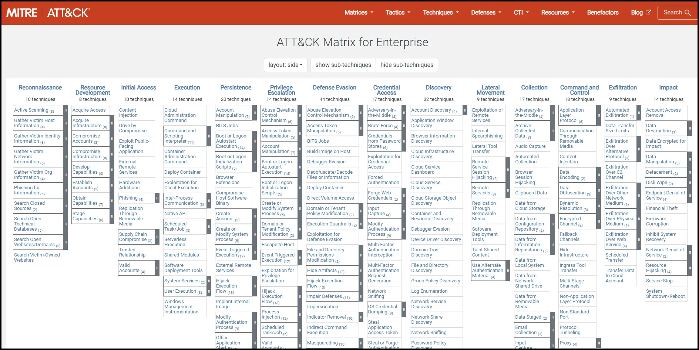
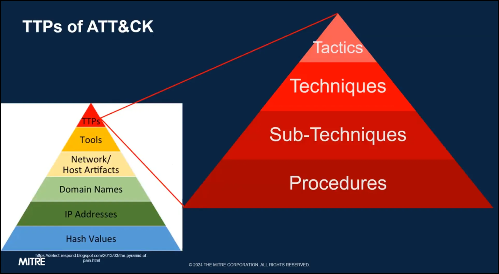

# Intro to MITRE ATT&CK

## Introduction

ATT&CK is a comprehensive knowledge base that catalogs adversary behaviors, tactics, techniques, and procedures based on real-world observations. It is freely accessible, globally available, curated by MITRE, and driven by community contributions.

### Pyramid of Pain and ATT&CK

As we explore the Pyramid of Pain, this module will show how ATT&CK organizes the top layers of the pyramid into tactics, techniques, sub-techniques, and procedures. We’ll discuss how matrices are used to visualize ATT&CK’s domains and platforms, how tactics structure these matrices, and how techniques and sub-techniques are integrated. Additionally, we’ll explore how these techniques link to defensive measures, such as mitigations, data sources, and detections, and how they can be mapped to adversary groups, software, and campaigns. We'll also examine how ATT&CK evolves over time.

By the end of this module, you will understand how ATT&CK's components interact and how to use this structure to understand threats and apply this knowledge to real-world scenarios.

In summary, ATT&CK was developed to document, understand, and respond to adversary behaviors. It is based on publicly reported cyber activity and models tactics, techniques, and procedures to connect to threat actors, campaigns, malware, tools, and defensive countermeasures.

## Matrices

ATT&CK uses matrix views to display the relationships among tactics, techniques, and sub-techniques. Each matrix view can represent a technology domain or a specific environment, as well as platforms or systems within it. For example, the enterprise matrix models a typical IT environment with 14 tactics and various techniques and sub-techniques, covering platforms like Windows, macOS, Linux, cloud technologies, and network infrastructure.

ATT&CK goes beyond the enterprise domain to cover other technologies that adversaries may target. Alongside the enterprise domain, ATT&CK includes matrices for mobile (Android and iOS) and ICS (targeting SCADA systems and other operational technology). Across these domains and platforms, ATT&CK maintains a consistent structure of tactics, techniques, and procedures. Adversaries often use overlapping techniques across different domains and may perform hybrid breaches that cross multiple domains and platforms.

In summary, ATT&CK matrices provide a visual structure to understand the relationships among tactics, techniques, and procedures within various technology domains and platforms. While each matrix is unique, they often share and overlap tactics, techniques, and sometimes procedures across domains.

## Tactics

ATT&CK Tactics represent the objectives of an adversary during an intrusion, helping us understand why they carry out certain actions and behaviors. Although the list of tactics may vary across technology domains, they remain relatively stable over time.

For instance, the 14 enterprise tactics each have a unique identifier, along with both short and detailed descriptions. In the matrix view, tactics form the column headers, or the first row, but they are not arranged in a specific order or sequence. Instead, they serve as the initial step in interpreting adversary behavior by addressing the "why."

In summary, ATT&CK Tactics define the goals behind adversary actions. Each tactic has a unique identifier and doesn’t dictate the order of behaviors, focusing instead on helping us understand the underlying motives for the techniques used.

## Techniques and Sub-Techniques

ATT&CK defines techniques as the methods adversaries use to accomplish their tactical objectives. Techniques are described from the adversary’s perspective, showing how they execute each action. For instance, the "user execution" technique under the execution tactic illustrates how adversaries may leverage legitimate user actions to gain execution.

While techniques vary across platforms and technology domains, there is substantial overlap, and the list evolves as adversaries develop new methods. ATT&CK also includes sub-techniques, which provide a more granular view of adversary behaviors. These sub-techniques further detail how adversaries achieve their goals, focusing on specific actions. For example, the user execution technique has sub-techniques that distinguish between users clicking on malicious links, files, or images.

Each technique has one parent but may have multiple sub-techniques, which are often platform-specific. This approach to sub-techniques helps maintain clarity as ATT&CK grows with new information about adversary tactics. Sub-techniques share the same objective as techniques but offer more specific insights.

Both techniques and sub-techniques are assigned unique identifiers, with sub-techniques using an extension of their parent technique’s ID. These identifiers are essential for linking to other parts of the ATT&CK framework, including defensive measures such as mitigations and detections, as well as procedures that connect to specific groups, software, and campaigns.

In summary, ATT&CK techniques and sub-techniques describe adversary behaviors, with techniques offering a general view and sub-techniques providing detailed descriptions of specific variations. This structure supports ATT&CK’s growth and refinement in representing adversary actions.

## Mitigations

ATT&CK Mitigations are configurations, tools, or processes that assist defenders in preventing a technique from succeeding or achieving the intended outcome for an adversary. These mitigations act as defensive countermeasures, guiding actions such as policy changes or tool deployments.

Each technique page in ATT&CK includes relevant mitigations, categorized and accompanied by descriptions explaining how to apply each to counter the specific technique. Mitigations also have their own dedicated pages, each with unique identifiers and descriptions that provide a broader view of how they relate to multiple techniques.

In summary, ATT&CK Mitigations offer strategies for preventing adversary techniques from succeeding. They are mapped to specific techniques on technique pages and have individual pages that outline their defensive applications.

## Data Sources and Detections

ATT&CK defines data sources as various types of information that can be gathered through sensors or logs to detect adversary behaviors. Data sources help answer what kind of data is needed and assist in identifying appropriate sensors or logs to detect adversary tactics.

Each data source in ATT&CK has a dedicated page with a unique identifier, description, and relevant metadata such as platform mappings. Data sources also have secondary elements called data components, which pinpoint specific events or fields within the collected data that are essential for detecting adversary actions. For instance, data components might include specific events like API calls within a process, file modifications, or network traffic content.

ATT&CK also includes detections, which are analytic strategies based on data sources and components. These detections describe how to interpret collected data to identify particular techniques or sub-techniques.

For example, the sub-technique for OS credential dumping via LSASS memory (T1003.001) may link to data sources such as process logs, along with data components like process access, API execution, and process creation. To operationalize, defenders can review specific logs or telemetry that align with these data components.

In summary, ATT&CK data sources and components guide what data to collect, while detections explain how to analyze it to identify adversary behaviors. Each of these elements is mapped to individual techniques and sub-techniques within ATT&CK.

## Groups Campaigns and Software

In the ATT&CK TTP (Tactics, Techniques, and Procedures) model, tactics define the *why* behind adversary actions, techniques and sub-techniques define *how* these goals are achieved, and procedures detail the specific ways adversaries implement techniques or sub-techniques. ATT&CK procedures link techniques to specific groups, campaigns, and software, with descriptions of how each technique was used.

ATT&CK tracks adversary activity through groups, campaigns, and software:

- **Groups** are clusters of related intrusion activities identified by a common name, each with a unique identifier, description, and mappings to techniques based on public threat intelligence. Groups may also be linked to campaigns and software.
- **Campaigns** represent intrusion activities over a set timeframe, aimed at specific targets. Each campaign has a unique identifier, description, and metadata (e.g., first and last observed dates), and may be associated with techniques, software, and threat actor groups.
- **Software** includes tools or malware adversaries use during intrusions, with each software entry linked to techniques and procedures and possibly connected to groups and campaigns.

For example, the ATT&CK entry for "Transparent Tribe" (Group G0134) shows its techniques and sub-techniques via procedures, along with associations to campaigns and multiple software tools, each with its own technique mappings.

In summary, techniques and sub-techniques connect to groups, campaigns, and software through procedures, which describe specific implementations. ATT&CK provides descriptions for each group, campaign, and software entry, detailing observed techniques and procedures from public sources.

## Benefits of Using ATT&CK

### Community Perspective

The MITRE ATT&CK team curates and publishes this collective knowledge base, drawing from publicly available research, reports, documentation, and direct insights or feedback from the community. Contributions from the global community play a crucial role, with references and citations prominently displayed on the ATT&CK website, linking to research and intelligence that ground ATT&CK in real-world threat data.

As users, we often need to examine and analyze these citations to deepen our understanding. ATT&CK benefits immensely from its community, whose contributions continually expand and refine the knowledge base, resulting in diverse ideas and practical applications to understand and counter adversary behaviors across various domains and platforms.

In summary, ATT&CK is built on publicly available intelligence and contributions from a global network of users. This approach ensures that ATT&CK represents a broad spectrum of technologies and operational scenarios without relying on proprietary or classified data.

### Common Language

Cyber and information security is inherently complex, requiring coordination among numerous technologies, processes, and people. Each resource operates with different levels of detail and information, making collaboration and communication essential for effective operations.

As we discussed earlier, ATT&CK enables consistent sharing of insights, particularly at the operational level, helping us describe and understand adversaries and their behaviors. This is crucial in aligning an adversary-focused perspective with defensive countermeasures.

Consider a common scenario where various operational teams, each with unique skills and viewpoints, face challenges in effectively communicating. This lack of context can lead to operational gaps. Here, ATT&CK serves as a unifying framework, adding context that enhances communication and leads to more informed decisions.

In summary, ATT&CK provides a shared language for describing adversary behaviors. This language, framed at the operational level, helps teams across different functions translate the adversary perspective into actionable defenses.

### Quantitative Scorecard

Being able to assess where we currently stand compared to where we need to be is essential for identifying strengths, recognizing gaps, and ensuring continuous improvement. However, in cyber and information security, this is challenging to quantify.

Using ATT&CK’s knowledge, perspective, and structured approach, organizations can start building a quantitative scorecard. For example, an organization might document its defense priorities by identifying the techniques most critical to defend against. By mapping these priorities to current defensive measures, they can quickly see gaps and areas for improvement.

While this is not an exhaustive assessment, even a brief analysis can reveal improvement opportunities. ATT&CK’s framework and various elements can support a more quantifiable understanding and narrative of security operations.

In summary, ATT&CK can help organizations create scorecards, ask critical questions, and measure how well defenses align with adversary tactics and techniques, though it does not provide a direct “safety” score for defenses.

### Attack Navigator

ATT&CK Navigator is a tool designed for both navigating and annotating ATT&CK matrices. ATT&CK Navigator allows users to manipulate matrix cells by highlighting techniques with colors, adding comments, or assigning numerical values, which can help create visualizations. These visualizations tell various stories, such as defensive coverage, red and blue team activities, and the frequency of techniques observed in cyber threat intelligence or other data sources.

Each customized view in ATT&CK Navigator is called a layer, which can be created interactively or programmatically, saved in JSON format, and shared among analysts or users. ATT&CK Navigator is open-source and available on the MITRE ATT&CK GitHub repository, along with documentation and setup instructions. MITRE also provides a public instance of Navigator online for anyone to explore.

Within the Navigator, users can select techniques mapped to groups, software, mitigations, and other ATT&CK elements, as well as export their custom views in JSON, Excel, or image files. Navigator’s features include creating and sharing layers, annotating shared layers, and creating layers for different ATT&CK domains.

Beyond Navigator, the ATT&CK site offers other ways to interact with ATT&CK data, including spreadsheets and Python utilities for generating Navigator layers and other outputs.

In summary, ATT&CK Navigator lets us create, annotate, save, and share customized ATT&CK views as layers, capturing stories and data mapped to ATT&CK techniques. 

## Operationalizing ATT&CK

### CTI

Cyber threat intelligence (CTI) focuses on understanding adversary actions, which is essential for decision-making and shaping cybersecurity operations. ATT&CK itself is built on CTI, providing a strong foundation for identifying behaviors and techniques reported for specific groups, campaigns, and malware tools.

One challenge with CTI is its variety of formats—ranging from formal reports to analyst notes and sensor observations. ATT&CK’s common language helps normalize and centralize these diverse sources of information, especially around tactics, techniques, and procedures.

In summary, CTI is vital for setting priorities and guiding cybersecurity operations. ATT&CK serves as both a starting point and a framework for organizing intelligence on adversary behaviors. 

### Detection and Analytics

Building on the previous lesson, Cyber Threat Intelligence (CTI) allows us not only to prioritize specific techniques but also to recognize patterns in how adversaries exploit these techniques. When combined with ATT&CK, CTI helps us set clearer defense goals against adversary behaviors. ATT&CK can serve as a starting framework for defining and deploying effective defenses.

As a practical example, the MITRE cyber analytic repository demonstrates how to operationalize ATT&CK knowledge by focusing on data sources and components to detect specific adversary techniques.

In summary, CTI helps prioritize where and how to build detection and analytics. ATT&CK provides additional context, highlighting technique variations and offering defensive suggestions focused on adversary tactics, techniques, and procedures. 

### Threat Emulation

We can expand our operational use of cyber threat intelligence (CTI) through intelligence-driven emulation, where red teams simulate known adversaries and threats. This approach is crucial for scoping and prioritizing threats to evaluate, as it allows us to observe, assess, and ultimately improve defenses from an adversary's perspective.

Reflecting on the previous lesson's detection analytics, a key question is whether our defenses sufficiently counter this technique or if ongoing evaluation and refinement are needed. ATT&CK provides the context and inputs necessary for developing threat-informed assessments, guiding red teams with quantitative and prioritized measures of cybersecurity defenses.

By using adversary emulation libraries, we can establish a structured, repeatable process that translates CTI into red team materials. This includes combining techniques, documenting defensive insights, and capturing lessons learned in detections and mitigations.

In summary, threat emulation is an offensive assessment approach that mimics specific adversaries or threats based on ATT&CK techniques. This approach helps us understand the wide range of potential procedure variations and enables defenders to strengthen defenses by viewing threats from an adversary's perspective.

### Assessment and Engineering

Ultimately, assessments are aimed at continuous improvement. ATT&CK provides a framework for measuring and tracking progress by assessing defensive coverage, prioritizing gaps, and adjusting defenses accordingly. As we discussed earlier, ATT&CK can help define a quantitative scorecard. Through testing different procedures, we can identify areas where defenses are strong and pinpoint gaps needing attention. This context helps us gauge our coverage across sub-techniques, techniques, and broader tactics.

Beyond hands-on assessments, we can also factor in critical organizational risks and those we choose to tolerate. These assessments pave the way for threat-driven security engineering, leading to continuous, informed security improvements.

In summary, threat-focused assessments help us measure our defensive posture and identify prioritized areas for threat-informed enhancements. 

### Threat Informed Defense

Cyber and information security is challenging, but it becomes more manageable when we coordinate, communicate, and work toward common goals. In security operations, it's essential to keep our purpose in mind, focusing on understanding threats and considering each action and decision carefully.

ATT&CK offers a structured, measurable way to understand, track, communicate, and respond to adversary activities. This knowledge helps operational resources gain both strategic and tactical advantages.

In summary, threat-informed defense integrates people, tools, processes, and everything that influences decision-making in security operations. ATT&CK helps us make better, threat-informed decisions across all areas of cybersecurity.

### Conclusion

In conclusion, we explored how ATT&CK supports threat-informed defense by using CTI to understand adversaries, building effective detections and analytics, evaluating these detections through threat emulation, and prioritizing improvements based on threat-informed assessments.