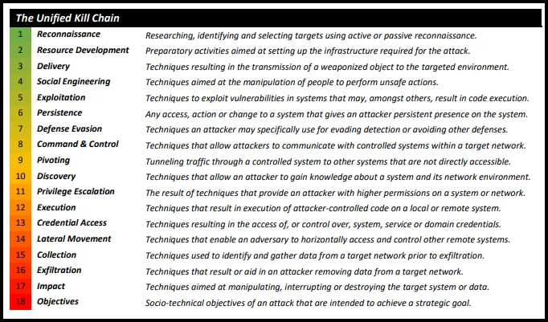
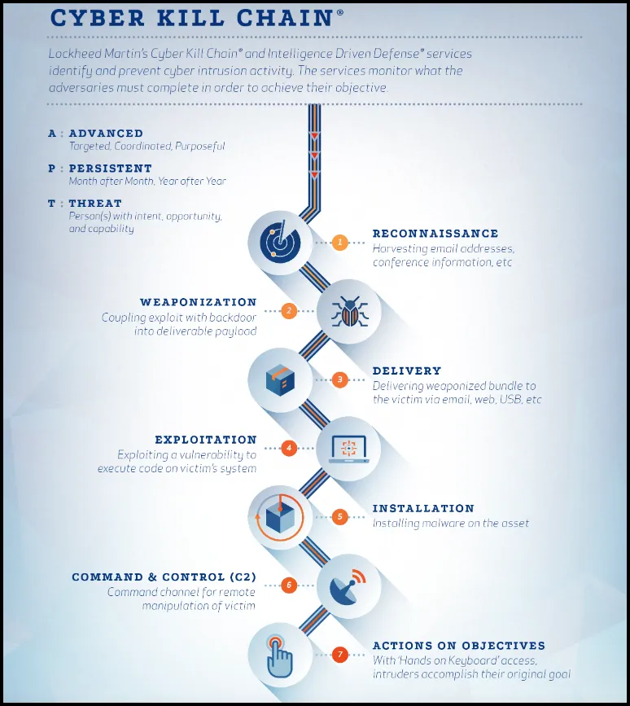

# **The Unified Kill Chain: An Enhanced Cybersecurity Framework**

**Overview:**
The Unified Kill Chain (UKC) is a modern cybersecurity framework that builds on the strengths of Lockheed Martin’s Cyber Kill Chain while addressing its limitations. Developed by Paul Pols in 2017, the UKC provides a comprehensive, flexible approach to analyzing and defending against advanced cyber threats. By expanding the original model, it covers a wider range of attack techniques and is adaptable to today’s complex, multi-stage threats.

---

**Background: The Cyber Kill Chain**

1. **The Cyber Kill Chain**, introduced in 2011 by Lockheed Martin, is a seven-stage model to understand and disrupt cyber attacks, primarily focused on external threats targeting enterprise networks:
    - **Reconnaissance**: Information gathering to identify target weaknesses.
    - **Weaponization**: Creation of malicious payloads to exploit those weaknesses.
    - **Delivery**: Transmitting the payload to the target via vectors like email or web links.
    - **Exploitation**: Using vulnerabilities to gain initial access.
    - **Installation**: Establishing malware persistence on the system.
    - **Command and Control (C2)**: Setting up communication channels for attacker control.
    - **Actions on Objectives**: Carrying out final malicious goals (e.g., data exfiltration, disruption).
2. **Limitations** of the Cyber Kill Chain:
    - **Limited Scope**: Focuses on initial compromise and data exfiltration but lacks detail on lateral movement and privilege escalation.
    - **Linear Structure**: Assumes a one-way attack sequence, which does not reflect the iterative, adaptive nature of modern attacks.
    - **External Threat Bias**: Does not address insider threats, privilege abuse, or attacks that bypass initial compromise.

---

**The Unified Kill Chain: Comprehensive "In, Through, and Out" Phases**

1. **Improving on the Cyber Kill Chain**, the UKC captures the full attack lifecycle, including internal movement and post-compromise activities, through **three high-level stages**:
    - **In**: Initial access or foothold into the target environment.
    - **Through**: Lateral movement, privilege escalation, and reconnaissance within the environment.
    - **Out**: Achieving final goals like data exfiltration, sabotage, or persistence.
2. **18 Detailed Phases**: Each stage contains specific phases, allowing a structured view of an attack:
    - **In**: Reconnaissance, Weaponization, Delivery, Exploitation, Installation, Command & Control.
    - **Through**: Internal Reconnaissance, Credential Access, Privilege Escalation, Lateral Movement.
    - **Out**: Collection, Exfiltration, Impact, Persistence.

---

**Detailed Breakdown of the "In, Through, Out" Stages**

1. **In**: Covers initial steps to establish a foothold.
    - **Reconnaissance**: Identifying weaknesses and gathering intelligence.
    - **Weaponization**: Crafting exploits or malicious payloads.
    - **Delivery**: Transmitting payloads (phishing emails, downloads).
    - **Exploitation**: Taking advantage of vulnerabilities to execute payloads.
    - **Installation**: Setting up malware or accounts for persistence.
    - **C2 (Command & Control)**: Establishing control channels to remotely manage the compromised system.
2. **Through**: Actions taken once inside the network to expand control.
    - **Internal Reconnaissance**: Gaining knowledge of network resources.
    - **Credential Access**: Stealing credentials for further access.
    - **Privilege Escalation**: Gaining elevated access rights.
    - **Lateral Movement**: Moving through the network to locate valuable assets.
3. **Out**: Completing objectives and maintaining presence.
    - **Collection**: Gathering data from sensitive areas.
    - **Exfiltration**: Removing data from the organization.
    - **Impact**: Causing disruption or harm to achieve objectives.
    - **Persistence**: Maintaining access to the environment despite potential detections.

---

**Key Improvements of the Unified Kill Chain Over the Cyber Kill Chain**

1. **Broader Coverage of Techniques**:
    - UKC includes more techniques beyond initial compromise and exfiltration, providing visibility into lateral movement, credential access, and privilege escalation.
    - It aligns with **MITRE ATT&CK** to cover a broad range of tactics and techniques, giving defenders insight into each attack phase.
2. **Flexible Structure for Adaptive Attacks**:
    - The **In-Through-Out** structure allows attackers to move non-linearly, making it suitable for real-world adaptive attacks. Attackers may move between phases repeatedly, adapting to defenses.
    - Defenders can monitor which phase they are detecting an attacker in, improving response strategies.
3. **Consideration of Insider and Post-Compromise Threats**:
    - UKC addresses insider threats and attacks that bypass the initial compromise stage.
    - Including phases for internal reconnaissance, credential access, and lateral movement enhances detection for both insider and external threats, making it useful for advanced persistent threats (APTs).
4. **Enhanced Defense-in-Depth Approach**:
    - With each phase associated with specific tactics, defenders can establish layered defenses across the entire lifecycle, providing multiple opportunities to disrupt an attack.
5. **Alignment with MITRE ATT&CK**:
    - UKC integrates MITRE ATT&CK’s detailed catalog of tactics and techniques, supporting consistent threat modeling and reporting.
    - Defenders can map the Unified Kill Chain phases to ATT&CK’s specific tactics, creating a comprehensive view of potential adversary behaviors.

---

**Unified Kill Chain and MITRE ATT&CK Alignment**

1. **In Stage (Initial Foothold)**: Initial access phases align with MITRE tactics like Reconnaissance, Initial Access, and Command and Control.
    - **Example Techniques**: Spearphishing, Active Scanning, Exploit Public-Facing Application.
2. **Through Stage (Network Propagation)**: Internal network activities align with Discovery, Lateral Movement, Credential Access, and Privilege Escalation.
    - **Example Techniques**: Network Share Discovery, Credential Dumping, Remote Desktop Protocol.
3. **Out Stage (Objectives)**: Final actions align with MITRE tactics for Collection, Exfiltration, Impact, and Persistence.
    - **Example Techniques**: Screen Capture, Exfiltration Over C2, Data Destruction.

---

**Benefits of Unified Kill Chain and MITRE ATT&CK Alignment**

1. **Granular Threat Actor Mapping**: By aligning UKC phases with MITRE ATT&CK, defenders can anticipate specific methods and tailor defenses to known threat actor behaviors.
2. **Improved Detection and Response**: The combined model enables a multi-layered defense by allowing defenders to focus on techniques associated with each phase.
3. **Comprehensive Attack Lifecycle Coverage**: UKC’s structure ensures defenders cover all stages of an attack, from Reconnaissance to Exfiltration.
4. **Support for Threat Actor Modeling**: By mapping specific threat actors’ TTPs, defenders gain insight into likely attacker actions.
5. **Defense-in-Depth Enablement**: The layered approach allows organizations to establish multiple detection and mitigation points along the kill chain.
6. **Continuous Improvement and Threat Awareness**: Alignment with MITRE ATT&CK, which frequently updates with new techniques, allows organizations to evolve defenses alongside emerging threats.

---

**Modeling Threat Actors with the Unified Kill Chain**

1. **Identify Vulnerabilities**: Organizations can evaluate where they’re vulnerable by analyzing which phases specific threat actors favor.
2. **Predict Attack Progression**: Knowing an adversary’s common methods helps predict their next moves.
3. **Tailor Defenses**: Mapping defenses to specific UKC phases and MITRE ATT&CK techniques allows for tailored strategies against known attacker methods.

---

**Summary: Why the Unified Kill Chain is an Improvement**

The Unified Kill Chain provides a more complete, adaptable, and realistic model of modern cyber attacks than the Cyber Kill Chain. It incorporates internal movement and post-compromise phases, adapting to non-linear attack strategies. This flexibility, combined with MITRE ATT&CK alignment, gives security teams a powerful tool to analyze, detect, and respond to advanced threats more effectively.

In conclusion, the Unified Kill Chain offers a structured, layered approach that allows organizations to build resilient defenses suited to today’s multi-stage, sophisticated threats. By combining it with MITRE ATT&CK, defenders gain a detailed roadmap to proactively address the complex challenges of modern cybersecurity.